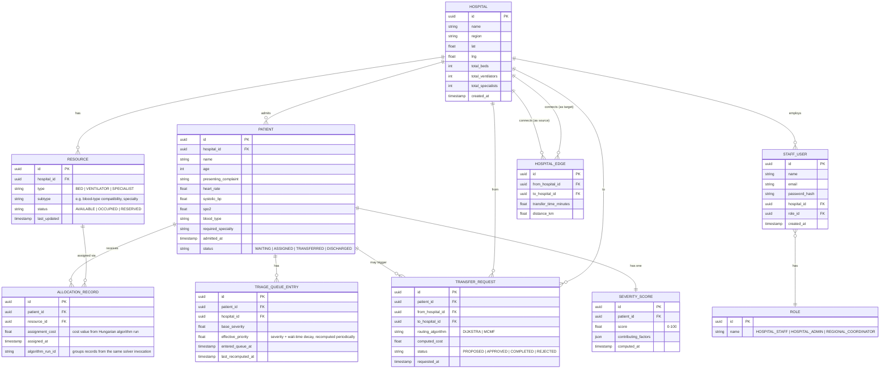

# ERD — TriageNet
### Entity Relationship Diagram & Schema Notes

## Notes on design decisions

- **`SEVERITY_SCORE` is a separate table from `PATIENT`**, not just a column, so historical
  scores can be tracked over time (a patient's condition can change, and this gives you an
  audit trail for the report/demo — "here's how this patient's priority evolved").
- **`TRIAGE_QUEUE_ENTRY.effective_priority`** is intentionally a stored, periodically recomputed
  value rather than something calculated purely on read — this matches the TRD's design of a
  scheduled job recomputing priorities, and it means the queue state is inspectable directly in
  the database at any point (useful for debugging and for the viva demo).
- **`ALLOCATION_RECORD.algorithm_run_id`** groups all assignments produced by a single Hungarian
  algorithm invocation, so you can show "this batch of 5 patients was matched to 5 resources in
  one solver run" — good for explainability in the demo.
- **`HOSPITAL_EDGE`** is a directed edge table representing the regional transfer graph; store it
  as directed even though transfer time is likely symmetric, since it keeps the graph algorithms
  (Dijkstra/MCMF) implementation simpler (uniform edge traversal, no special-casing).
- **`TRANSFER_REQUEST.routing_algorithm`** records which algorithm produced the routing decision
  (Dijkstra for MVP, MCMF if the stretch goal is reached) — useful both for testing and for
  showing the algorithmic range in the final report.
- Resource `subtype` is deliberately a loose string field (not a separate lookup table) to keep
  the schema simple within the 5-week timeline — document this as a simplification if asked in
  viva, not a design you'd necessarily keep in a production system.

## Suggested indexes

- `PATIENT(hospital_id, status)` — fast lookup of waiting patients per hospital.
- `TRIAGE_QUEUE_ENTRY(hospital_id, effective_priority DESC)` — fast queue retrieval in priority order.
- `RESOURCE(hospital_id, type, status)` — fast lookup of available resources by type.
- `HOSPITAL_EDGE(from_hospital_id)` — fast adjacency lookup for graph traversal.
