<div align="center">


# TriageNet

### AI-powered state-wide hospital emergency triage & spatial resource allocation platform for Jharkhand government healthcare

[](https://nextjs.org/)
[](https://spring.io/projects/spring-boot)
[](https://python.org/)
[](https://postgresql.org/)
[](https://leafletjs.com/)
[](LICENSE)

</div>

---

## Table of Contents

- [Overview](#overview)
- [Key Features](#key-features)
- [System Architecture](#system-architecture)
- [Component Architecture Diagram](#component-architecture-diagram)
- [Data Flow Diagrams](#data-flow-diagrams)
- [Use Case Diagrams](#use-case-diagrams)
- [Autonomous AI Agents](#autonomous-ai-agents)
- [6-Role RBAC Architecture](#6-role-rbac-architecture)
- [Spatial Routing Engine](#spatial-routing-engine)
- [Tech Stack](#tech-stack)
- [Getting Started](#getting-started)
- [Project Structure](#project-structure)
- [ML Pipeline](#ml-pipeline)
- [ML Research & Multi-Dataset Benchmarking](#ml-research--multi-dataset-benchmarking)
- [State-Wide Scaling Vision](#state-wide-scaling-vision)
- [Development Progress](#development-progress)
- [Environment Variables](#environment-variables)
- [License](#license)

---

## Overview

**TriageNet** is a state-wide healthcare emergency operations and spatial resource allocation platform designed as a **Final Year CSBS Project (PG300604)**. It connects **111 government healthcare facilities across all 24 districts of Jharkhand** (*Medical Colleges, Sadar Hospitals, Sub-Divisional Referral Centers, and CHCs*), enabling live spatial Dijkstra routing and traffic-aware ambulance dispatching when regional facilities face surge capacity overflow.

The system uses **machine learning severity scoring**, **Haversine & OpenRouteService (ORS) spatial distance matrices**, **Dijkstra shortest-path regional load balancing**, **multi-resource clinical compatibility matching (Hungarian matching)**, **autonomous 24/7 AI supply & financial agents**, and **6-role RBAC security controls**.

---

## Key Features

### AI & ML Severity Engine
| Feature | Description |
|---------|-------------|
| **ML Severity Scorer** | Logistic Regression model trained on clinical vitals (SpO₂, HR, BP, Temp, Resp Rate, Age) producing real-time 0–100 severity scores with $\text{Sigmoid}(W \cdot X + b)$ |
| **Sepsis Early Warning** | Automatic alert triggering when SpO₂ < 90% and HR > 110 bpm with clinical risk propagation |
| **Explainable AI** | Top factor attribution with exact percentage breakdowns per patient |
| **Dynamic Priority Heap** | Acuity score combined with wait-time decay ($E = S + \lambda \cdot W$) preventing queue starvation |

### 🗺️ OpenRouteService & Leaflet Spatial Routing
| Feature | Description |
|---------|-------------|
| **Haversine & ORS Distance Matrix** | Calculates real road driving distances (km) and travel durations (minutes) between patient/ambulance GPS coordinates and candidate hospitals |
| **Interactive Leaflet Map** | OpenStreetMap tile layer rendering color-coded hospital capacity markers (🟢 <60%, 🟡 60–80%, 🔴 >80% surge) across all 24 districts |
| **108 Ambulance Dispatcher** | Live ambulance location pin and animated polyline road routing to optimal referral destination |
| **24-District Segregation** | Statewide overview mode or district-specific filtering with facility tier locks (*TERTIARY, DISTRICT, SUB_DIVISIONAL, CHC*) |

### 108 Ambulance Tactical Command System
| Feature | Description |
|---------|-------------|
| **Incident Intake Console** | Select incident types (NH-33 collision, coal mine collapse, chemical blast, acute STEMI), patient info, and vehicle units |
| **Multi-Criteria Dijkstra Scoring** | Dynamically scores candidate hospitals on road ETA, ICU beds, ventilators, and trauma surgeons |
| **1-Click Bed Pre-Booking** | Generates dispatch token `#JH-108-DISPATCH-XXXX`, reserves ICU bed, injects patient into receiving triage queue |
| **In-Flight Fleet Telemetry** | Live countdown timer and arrival bed handover action |

### Autonomous AI Supply Demand & Dispatcher Engine
| Feature | Description |
|---------|-------------|
| **Autonomous 24/7 Telemetry** | Continuously monitors regional hospital bed and ICU capacity loads without requiring manual button triggers |
| **Dynamic Need Calculator** | Computes exact dynamic deficits based on situation severity (Mass Casualty vs Regional Surge vs Steady State) |
| **Darkroom Terminal CLI** | Interactive macOS/Linux terminal streaming 100% live computed telemetry, bottleneck metrics, AI solutions, and embedded operator permission controls |
| **Dynamic Need Flagging** | Automatically raises live supply flags for strained facilities (Load ≥ 70%) with one-click live approval |

### AI Financial & Equipment Cost Management Agent (Indian Rupees ₹)
| Feature | Description |
|---------|-------------|
| **Rupees (₹) Denomination** | Managed in Indian Rupees (₹) across ₹12.80 Crore total regional operating budget |
| **Equipment Asset Ledger** | Capital asset and maintenance expense tracking for Ventilators (₹15.20 L), ICU Beds (₹4.80 L), General Beds (₹1.10 L), O₂ Generators (₹2.45 L), and Trauma Kits (₹65k) |
| **Net Cost Recovery Surplus** | Computes `Gross Recovered Care Revenue - Equipment Maintenance Expenses` (+₹1.46 Cr Surplus) with a **142.7% Cost Recovery Ratio** |
| **Financial Terminal CLI** | Interactive darkroom terminal streaming live financial telemetry, asset valuations, and budget health diagnostics |

### Algorithmic Core
| Feature | Description |
|---------|-------------|
| **Dijkstra Regional Referrals** | Graph-weighted shortest-path inter-hospital transfers with real-time travel time computation |
| **Multi-Resource Clinical Matching** | 3-way verification: `Open Beds ∧ Equipment Match ∧ Specialist Available` before any assignment |
| **Hungarian Bed Assignment** | Optimal patient-to-bed matching considering severity and resource compatibility |
| **Auto-Play Simulation** | Continuous stress testing with random arrivals, preemption cycles, discharge events, and anomaly detection |

### Operations Dashboard & Telemetry
| Feature | Description |
|---------|-------------|
| **12 Operational Pages** | Dashboard, Patients, Triage Queue, Regional Network, AI CDS, Appointments, Clinical Operations, Billing & Revenue, Medical Records, Inventory & Supplies, Reports & Analytics, Communications |
| **Zero Emoji Enterprise UI** | 100% emoji-purged serious clinical interface with Lucide iconography and monospace bracketed tags |
| **Live Risk Analytics** | Severe Preemption Risk Index, Specialist Matching Donut Gauge, SVG Wait Latency Trend Chart, and Realtime Financial Cost vs Recovery Bar Graph |
| **Supply Reallocation** | Inter-hospital equipment transfer with one-click coordinator approval and terminal streaming |
| **Dynamic Calendar** | Real-time date-aware appointment booking with future scheduling |

---

## System Architecture

### High-Level Architecture Diagram

```mermaid
flowchart TB
    subgraph Client["🖥️ Next.js 16 Frontend — TypeScript / Tailwind CSS v4"]
        Landing["Landing Page<br/>(Hero, ECG Waveform, Algorithm Showcase)"]
        AuthUI["Role-Based Login Portal<br/>(6 Preset RBAC Roles)"]
        Dashboard["Command Dashboard Controller<br/>(dashboard.tsx)"]
        subgraph Views["12 Operational Domain Views"]
            QueueView["Triage Queue<br/>(Priority Heap E=S+λW)"]
            NetView["Regional Network<br/>(Leaflet GIS + Dijkstra SVG)"]
            CapView["Capacity &<br/>Bed Operations"]
            PatView["Patient Records<br/>& ML Scorer"]
            AICDSView["AI Clinical<br/>Decision Support"]
            DispatchView["108 Ambulance<br/>Tactical Command"]
            BillingView["Billing &<br/>Revenue (₹)"]
            ReportsView["Risk Telemetry<br/>& Analytics"]
        end
        ClientLib["Client State Engine<br/>(triage-data.ts / jharkhand-data.ts / api-client.ts)"]
    end

    subgraph Backend["☕ Spring Boot 3.2.5 Backend — Java 17"]
        Security["Spring Security<br/>+ JWT Auth Filter"]
        subgraph Controllers["REST API Controllers"]
            AuthCtrl["/api/auth"]
            QueueCtrl["/api/triage-queue"]
            RoutingCtrl["/api/routing"]
            HospCtrl["/api/hospitals"]
            DashCtrl["/api/dashboard"]
            PatCtrl["/api/patients"]
            ResCtrl["/api/resources"]
        end
        subgraph Engines["⚙️ Algorithmic Engines"]
            MLScorer["SeverityScorer<br/>(Logistic Regression)"]
            HeapEngine["Priority Heap<br/>(S + λ × W)"]
            Dijkstra["DijkstraRouter<br/>(Shortest Path)"]
            Hungarian["HungarianMatcher<br/>(Bed+Equip+Specialist)"]
        end
        subgraph DataLayer["💾 JPA Repositories + PostgreSQL"]
            DistRepo["Districts (24)"]
            HospRepo["Hospitals (111)"]
            PatRepo["Patients & Vitals"]
            EdgeRepo["Hospital Road Edges"]
            ResRepo["Resources & Equipment"]
        end
    end

    Landing --> AuthUI --> Dashboard
    Dashboard --> Views
    Views --> ClientLib
    ClientLib <== "REST API / JSON<br/>Bearer JWT" ==> Security
    Security --> Controllers
    Controllers --> Engines
    Engines --> DataLayer

    style Client fill:#fdf8f0,stroke:#382416,color:#2c1b0e
    style Backend fill:#f0f4f8,stroke:#1e3a5f,color:#1e3a5f
    style Engines fill:#fff3e0,stroke:#dc5000,color:#382416
    style DataLayer fill:#e8f5e9,stroke:#2e7d32,color:#1b5e20
```

---

## Component Architecture Diagram

### Frontend Component Hierarchy

```mermaid
graph TD
    RootLayout["app/layout.tsx<br/>(AuthProvider + ThemeProvider + SEO Metadata)"]

    RootLayout --> LandingPage["app/page.tsx — Landing Page"]
    RootLayout --> LoginPage["app/login/page.tsx — Staff Authentication"]
    RootLayout --> DashPage["app/dashboard/page.tsx — Command Console"]

    LandingPage --> Navbar["navbar.tsx"]
    LandingPage --> Hero["hero.tsx + ECG Waveform"]
    LandingPage --> StatsBand["stats-band.tsx"]
    LandingPage --> ProblemSec["problem-section.tsx"]
    LandingPage --> AlgoShowcase["algorithm-showcase.tsx"]
    LandingPage --> GraphShowcase["interactive-graph-showcase.tsx"]
    LandingPage --> HowItWorks["how-it-works-pinned.tsx"]
    LandingPage --> CTAFooter["cta-footer.tsx"]

    DashPage --> DashController["dashboard.tsx — View Router"]

    DashController --> Sidebar["sidebar.tsx<br/>(RBAC Nav Filter)"]
    DashController --> TopBar["top-bar.tsx<br/>(Scenario Switch + Clock)"]

    DashController --> CapacityView["capacity-view.tsx"]
    DashController --> PatientsView["patients-view.tsx"]
    DashController --> TriageQueue["triage-queue-view.tsx"]
    DashController --> RegionalNet["regional-network-view.tsx"]
    DashController --> AICDSView["aicds-view.tsx"]
    DashController --> AppointView["appointments-view.tsx"]
    DashController --> ClinicalView["clinical-view.tsx"]
    DashController --> BillingView["billing-view.tsx"]
    DashController --> DocsView["docs-view.tsx"]
    DashController --> SuppliesView["supplies-view.tsx"]
    DashController --> ReportsView["reports-view.tsx"]
    DashController --> CommsView["comms-view.tsx"]

    RegionalNet --> LeafletMap["leaflet-map.tsx<br/>(OpenStreetMap + Markers)"]
    RegionalNet --> DijkstraSVG["Dijkstra SVG Topology Graph"]
    RegionalNet --> AmbulanceCmd["108 Tactical Command Console"]

    DashController --> AISupplyModal["ai-supply-terminal-modal.tsx"]
    DashController --> AIFinModal["ai-financial-terminal-modal.tsx"]

    subgraph LibLayer["📚 Core Libraries (frontend/lib/)"]
        TriageData["triage-data.ts<br/>(State Engine + Algorithms)"]
        JharkhandData["jharkhand-data.ts<br/>(111 Hospitals × 24 Districts)"]
        APIClient["api-client.ts<br/>(REST + JWT)"]
        AuthCtx["auth-context.tsx<br/>(6-Role RBAC)"]
        MLScorer["ml-severity-scorer.ts<br/>(Logistic Regression)"]
    end

    DashController --> TriageData
    DashController --> JharkhandData
    DashController --> APIClient
    DashController --> AuthCtx
    TriageQueue --> MLScorer

    style RootLayout fill:#382416,stroke:#382416,color:#ffedd7
    style DashController fill:#dc5000,stroke:#dc5000,color:#fff
    style LibLayer fill:#f5f0e8,stroke:#6c5f51,color:#382416
```

### Backend Package Architecture

```mermaid
graph TD
    App["TriageNetApplication.java<br/>(Spring Boot Entry)"]

    App --> ConfigPkg["config/"]
    App --> CtrlPkg["controller/"]
    App --> EnginePkg["engine/"]
    App --> EntityPkg["entity/"]
    App --> RepoPkg["repository/"]
    App --> ServicePkg["service/"]

    ConfigPkg --> SecConfig["SecurityConfig.java"]
    ConfigPkg --> JWTFilter["JwtAuthenticationFilter.java"]
    ConfigPkg --> UserDetails["CustomUserDetails.java"]

    CtrlPkg --> AuthCtrl["AuthController<br/>/api/auth"]
    CtrlPkg --> DashCtrl["DashboardController<br/>/api/dashboard"]
    CtrlPkg --> HospCtrl["HospitalController<br/>/api/hospitals"]
    CtrlPkg --> PatCtrl["PatientController<br/>/api/patients"]
    CtrlPkg --> RefCtrl["ReferralController<br/>/api/referrals"]
    CtrlPkg --> ResCtrl["ResourceController<br/>/api/resources"]
    CtrlPkg --> RouteCtrl["RoutingController<br/>/api/routing"]
    CtrlPkg --> QueueCtrl["TriageQueueController<br/>/api/triage-queue"]

    EnginePkg --> DijkstraR["DijkstraRouter.java"]
    EnginePkg --> HungarianM["HungarianMatcher.java"]
    EnginePkg --> SevScorer["SeverityScorer.java"]

    ServicePkg --> AuthSvc["AuthService"]
    ServicePkg --> HospSeedSvc["HospitalSeedService"]
    ServicePkg --> HospSvc["HospitalService"]
    ServicePkg --> PatSvc["PatientService"]
    ServicePkg --> RefSvc["ReferralService"]
    ServicePkg --> SpatialSvc["SpatialRoutingService"]
    ServicePkg --> QueueSvc["TriageQueueService"]

    EntityPkg --> Hospital["Hospital.java"]
    EntityPkg --> District["District.java"]
    EntityPkg --> Patient["Patient.java"]
    EntityPkg --> Resource["Resource.java"]
    EntityPkg --> HospEdge["HospitalEdge.java"]
    EntityPkg --> StaffUser["StaffUser.java"]

    CtrlPkg --> ServicePkg
    ServicePkg --> EnginePkg
    ServicePkg --> RepoPkg
    RepoPkg --> EntityPkg

    style App fill:#6DB33F,stroke:#6DB33F,color:#fff
    style EnginePkg fill:#fff3e0,stroke:#dc5000,color:#382416
    style CtrlPkg fill:#e3f2fd,stroke:#1565c0,color:#0d47a1
    style ServicePkg fill:#fce4ec,stroke:#c62828,color:#b71c1c
```

---

## Data Flow Diagrams

### DFD Level 0 — Context Diagram

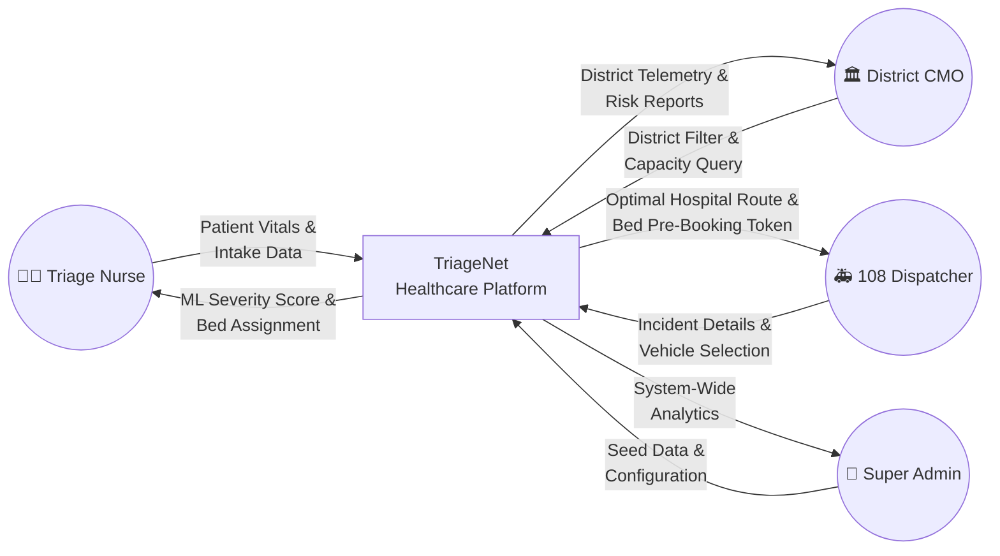

### DFD Level 1 — Major Subsystems

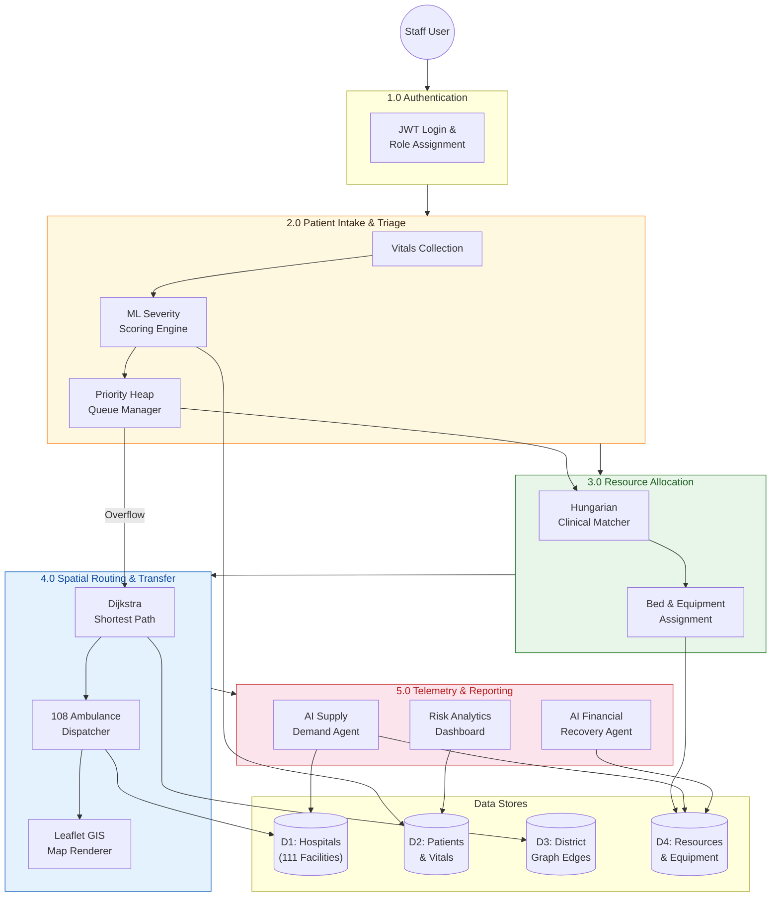

### DFD Level 2 — Patient Triage Pipeline (Detailed)

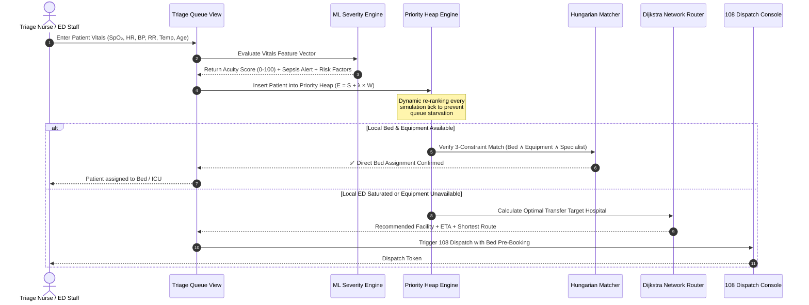

### 108 Ambulance Dispatch — 4-Stage Golden Hour Flow

```mermaid
flowchart LR
    subgraph Stage1["Stage 1: Incident Intake"]
        S1A["Select Incident Type<br/>(NH-33 Collision, STEMI, etc.)"]
        S1B["Enter Patient Details<br/>& Tune Live Vitals"]
        S1C["Select ALS/BLS<br/>Vehicle Unit"]
    end

    subgraph Stage2["Stage 2: Hospital Scoring"]
        S2A["Dijkstra Multi-Criteria<br/>Score Computation"]
        S2B["Rank Hospitals by<br/>ETA + ICU + Ventilators<br/>+ Trauma Surgeons"]
    end

    subgraph Stage3["Stage 3: Bed Pre-Booking"]
        S3A["Generate Token<br/>#JH-108-DISPATCH-XXXX"]
        S3B["Reserve ICU Bed<br/>at Target Hospital"]
        S3C["Inject Patient into<br/>Receiving Triage Queue"]
    end

    subgraph Stage4["Stage 4: In-Flight Telemetry"]
        S4A["Live ETA<br/>Countdown Timer"]
        S4B["Draw Active<br/>Transfer Route"]
        S4C["⚡ MARK ARRIVED<br/>(Bed Handover)"]
    end

    Stage1 --> Stage2 --> Stage3 --> Stage4

    style Stage1 fill:#fff3e0,stroke:#e65100,color:#382416
    style Stage2 fill:#e3f2fd,stroke:#1565c0,color:#0d47a1
    style Stage3 fill:#e8f5e9,stroke:#2e7d32,color:#1b5e20
    style Stage4 fill:#fce4ec,stroke:#c62828,color:#b71c1c
```

### Secure 108 Referral & Bed Pre-Booking Sequence Diagram

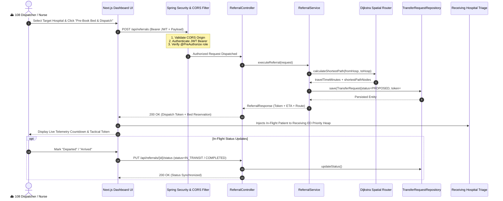

---

## Use Case Diagrams

### Primary Use Case Diagram — All Actors

```mermaid
flowchart TB
    subgraph Actors["System Actors"]
        SA(("Super Admin"))
        SHD(("State Health<br/>Dept Director"))
        CMO(("District CMO"))
        HA(("Hospital Admin"))
        TN(("Triage Nurse"))
        AD(("108 Dispatcher"))
    end

    subgraph UseCases["TriageNet Use Cases"]
        UC1["UC1: Authenticate &<br/>Select Role"]
        UC2["UC2: View Statewide<br/>Capacity Dashboard"]
        UC3["UC3: Register Patient<br/>& Score Vitals"]
        UC4["UC4: Manage Triage<br/>Priority Queue"]
        UC5["UC5: Assign Bed via<br/>Hungarian Matcher"]
        UC6["UC6: Request Inter-Hospital<br/>Transfer (Dijkstra)"]
        UC7["UC7: Dispatch 108<br/>Ambulance"]
        UC8["UC8: Pre-Book Receiving<br/>Hospital Bed"]
        UC9["UC9: View District<br/>Risk Reports"]
        UC10["UC10: Manage Appointments<br/>& Calendar"]
        UC11["UC11: Track Billing<br/>& Revenue (₹)"]
        UC12["UC12: Monitor Supply<br/>Inventory"]
        UC13["UC13: AI Clinical<br/>Decision Support"]
        UC14["UC14: Emergency<br/>Communications"]
        UC15["UC15: Seed Hospital<br/>Data & Config"]
    end

    SA --> UC1 & UC2 & UC3 & UC4 & UC5 & UC6 & UC7 & UC8 & UC9 & UC10 & UC11 & UC12 & UC13 & UC14 & UC15
    SHD --> UC1 & UC2 & UC9 & UC12 & UC14
    CMO --> UC1 & UC2 & UC4 & UC6 & UC9 & UC14
    HA --> UC1 & UC2 & UC5 & UC10 & UC11 & UC12
    TN --> UC1 & UC3 & UC4 & UC13
    AD --> UC1 & UC6 & UC7 & UC8 & UC14

    style UseCases fill:#fdf8f0,stroke:#382416,color:#2c1b0e
    style Actors fill:#e3f2fd,stroke:#1565c0,color:#0d47a1
```

### Use Case: Triage Nurse — ED Patient Intake

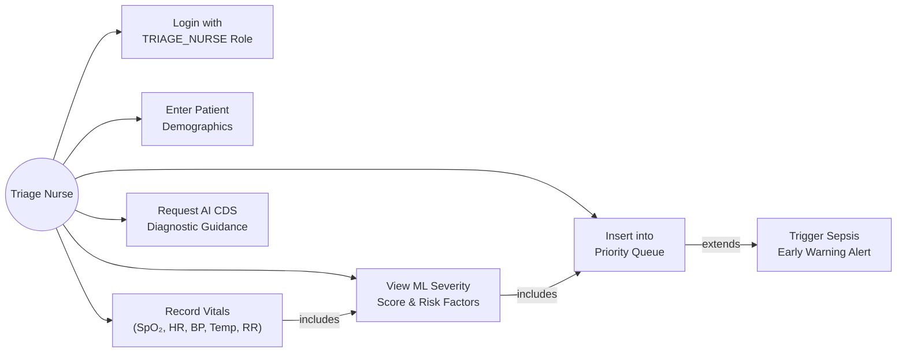

### Use Case: 108 Ambulance Dispatcher

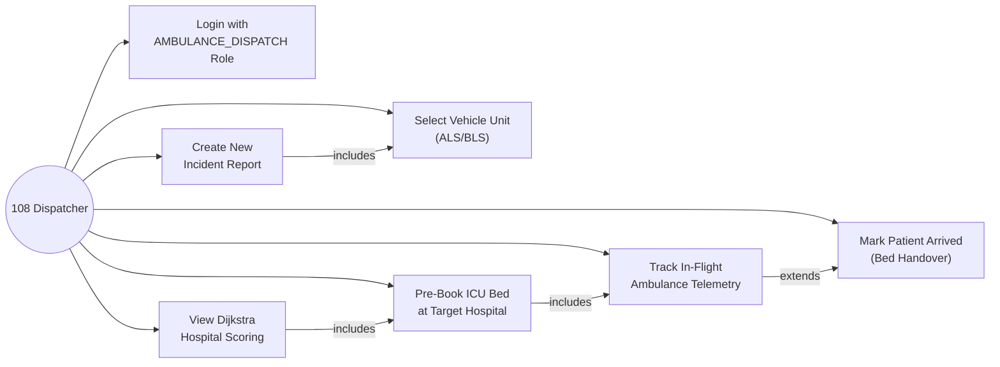

---

## Autonomous AI Agents

| Agent Name | Primary Responsibility | Telemetry Output |
|------------|------------------------|------------------|
| **AI Supply Demand Agent** | Analyzes hospital surge loads, calculates dynamic bed & ventilator deficits, streams CLI terminal telemetry, and dispatches equipment upon human operator authorization | Live macOS/Linux CLI Terminal (`ai-supply-terminal-modal.tsx`) |
| **AI Financial Cost Recovery Agent** | Tracks equipment asset valuations, manages ₹12.80 Cr operating budget, calculates maintenance costs, and auto-reallocates revenue recovery surpluses (+₹1.46 Cr) | Live macOS/Linux CLI Terminal (`ai-financial-terminal-modal.tsx`) |
| **Dijkstra Regional Overflow Agent** | Evaluates weighted network graph to route patient overflow to non-congested facilities with matching equipment & specialist physicians | Real-Time Routing Latency Trend Chart (`reports-view.tsx`) |

---

## 6-Role RBAC Architecture

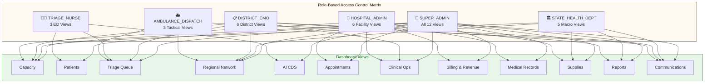

| User Role | Access Scope | Permitted Views |
|-----------|--------------|-----------------| 
| **System Super Admin** | Global Platform | **ALL 12 Views**: Unrestricted statewide control & DB seed management |
| **State Health Dept Director** | Statewide Governance | **5 Macro Views**: Statewide Capacity, Hospital Network Graph, Supplies, Risk Reports, State Comms |
| **District CMO** | District Administration | **6 Views** (Locked to assigned District, e.g. Ranchi): District Capacity, Overflow Queue, Clinical Ops, Reports, Comms |
| **Medical Superintendent** | Hospital Operations | **6 Views** (Locked to assigned Facility, e.g. RIMS Ranchi): Capacity, Clinical Beds, Appointments, Billing in ₹, Inventory, Medical Records |
| **Emergency Triage Nurse** | Front-line ED Intake | **3 Views**: Triage Priority Queue, Patients & Vitals Scorer, AI CDS |
| **108 Ambulance Dispatcher** | Call Center Dispatch | **3 Tactical Views**: Regional Spatial Network Map, Dispatch Queue, Emergency Comms |

---

## Spatial Routing Engine

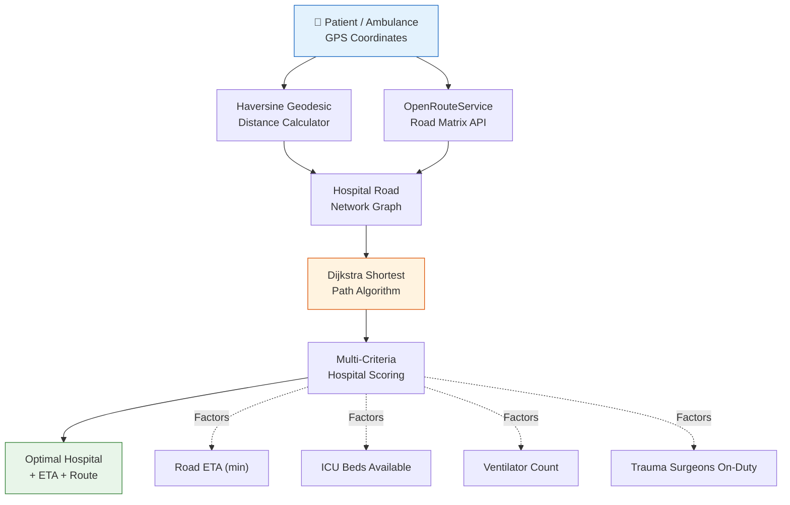

---

## Tech Stack

| Layer | Technology |
|-------|-----------|
| **Frontend** | Next.js 16 (Turbopack) · React 19 · Tailwind CSS v4 · Leaflet.js · Framer Motion · Anime.js · Lucide React |
| **Backend** | Spring Boot 3.2.5 · Java 17 · Spring Data JPA · Spring Security + JWT Auth |
| **Spatial Routing** | OpenRouteService (ORS) Matrix API · Haversine Geodesic Math · Dijkstra Shortest-Path Engine |
| **ML Pipeline** | Python · scikit-learn · Logistic Regression |
| **Database** | PostgreSQL 16 (H2 in-memory for local dev) |
| **Infrastructure** | Docker Compose · Multi-container orchestration |
| **Design System** | Panacea Healthcare SaaS — Walnut Shadow & Warm Cream Canvas |
| **SEO & PWA** | Sitemap · Robots.txt · Web Manifest · Schema.org JSON-LD · OpenGraph & Twitter Cards |

---

## Getting Started

### Prerequisites

- **Node.js** ≥ 20.x
- **Java** 17+
- **Python** 3.10+ (for ML training only)
- **Docker** & **Docker Compose** (optional, for full stack)

### Quick Start

```bash
# Clone the repository
git clone https://github.com/PG300604/TriageNet.git
cd TriageNet

# Start Backend Server (Terminal 1)
cd backend
.\mvnw.cmd spring-boot:run "-Dspring-boot.run.profiles=local"

# Start Frontend Dev Server (Terminal 2)
cd frontend
npm install
npm run dev
```

Open [http://localhost:3000/login](http://localhost:3000/login) for the authentication portal and [http://localhost:3000/dashboard](http://localhost:3000/dashboard) for the command console.

---

## Project Structure

```
TriageNet/
├── backend/
│   ├── src/main/java/com/triagenet/
│   │   ├── TriageNetApplication.java   # Spring Boot entry point
│   │   ├── config/                     # SecurityConfig, JwtAuthenticationFilter, CustomUserDetails
│   │   ├── controller/                 # 7 REST Controllers (Auth, Dashboard, Hospital, Patient,
│   │   │                               #   Resource, Routing, TriageQueue)
│   │   ├── dto/                        # LoginRequest, LoginResponse, RegisterRequest, UserDto
│   │   ├── engine/                     # DijkstraRouter, HungarianMatcher, SeverityScorer
│   │   ├── entity/                     # 15 JPA Entities (Hospital, District, Patient, Resource,
│   │   │                               #   HospitalEdge, StaffUser, Role, TriageQueueEntry, etc.)
│   │   ├── exception/                  # GlobalExceptionHandler
│   │   ├── repository/                 # 11 Spring Data JPA Repositories
│   │   ├── service/                    # 8 Business Services (Auth, HospitalSeed, Hospital,
│   │   │                               #   Patient, Referral, SpatialRouting, TriageQueue)
│   │   └── util/                       # JwtUtil (HMAC-SHA256 token generation)
│   └── src/main/resources/seed/        # jharkhand-hospitals.json (111 facilities)
│
├── frontend/
│   ├── app/                            # Next.js App Router
│   │   ├── layout.tsx                  # Root layout + SEO metadata + JSON-LD + PWA tags
│   │   ├── page.tsx                    # Landing page compositor
│   │   ├── globals.css                 # Tailwind CSS v4 design tokens
│   │   ├── sitemap.ts                  # Dynamic SEO sitemap generator
│   │   ├── robots.ts                   # SEO crawler rules
│   │   ├── manifest.ts                 # PWA web manifest
│   │   ├── dashboard/page.tsx          # Command dashboard view
│   │   └── login/                      # Login portal (page.tsx + layout.tsx)
│   │
│   ├── components/
│   │   ├── landing/                    # 10 Landing page components + motion primitives
│   │   │   ├── navbar.tsx              # Sticky navigation with official TriageNet logo
│   │   │   ├── hero.tsx                # Animated hero with ECG waveform
│   │   │   ├── algorithm-showcase.tsx  # Algorithm explanation cards
│   │   │   ├── interactive-graph-showcase.tsx  # Dijkstra graph preview
│   │   │   └── cta-footer.tsx          # Call-to-action footer
│   │   │
│   │   └── triagenet/                  # 20 Dashboard operational components
│   │       ├── dashboard.tsx           # Central view router (402 lines)
│   │       ├── sidebar.tsx             # RBAC navigation drawer (185 lines)
│   │       ├── top-bar.tsx             # Scenario switch + simulation clock (365 lines)
│   │       ├── triage-queue-view.tsx   # Priority Heap management (675 lines)
│   │       ├── regional-network-view.tsx  # GIS + Dijkstra + 108 Dispatch (991 lines)
│   │       ├── leaflet-map.tsx         # OpenStreetMap interactive map (282 lines)
│   │       ├── patients-view.tsx       # Patient registry + ML scorer (292 lines)
│   │       ├── capacity-view.tsx       # Bed & ICU occupancy meters (222 lines)
│   │       ├── billing-view.tsx        # Revenue & PM-JAY claims (533 lines)
│   │       ├── reports-view.tsx        # Risk telemetry analytics (503 lines)
│   │       ├── supplies-view.tsx       # Equipment inventory (272 lines)
│   │       ├── appointments-view.tsx   # Scheduling calendar (334 lines)
│   │       ├── aicds-view.tsx          # AI Clinical Decision Support (180 lines)
│   │       ├── clinical-view.tsx       # Ward operations & shifts (191 lines)
│   │       ├── ai-supply-terminal-modal.tsx    # AI Supply Agent CLI (376 lines)
│   │       └── ai-financial-terminal-modal.tsx # AI Financial Agent CLI (209 lines)
│   │
│   ├── lib/                            # Core TypeScript libraries
│   │   ├── triage-data.ts              # State engine + algorithms (902 lines)
│   │   ├── jharkhand-data.ts           # 111 hospitals × 24 districts (2,835 lines)
│   │   ├── api-client.ts              # REST client + JWT auth (224 lines)
│   │   ├── auth-context.tsx           # 6-role RBAC context (186 lines)
│   │   ├── ml-severity-scorer.ts      # Client-side ML inference (96 lines)
│   │   └── utils.ts                   # Tailwind class combiner (7 lines)
│   │
│   └── public/                         # Static assets
│       ├── triagenet-logo.png          # Official TriageNet brand logo
│       ├── icon.svg                    # Vector favicon
│       └── favicon.ico                 # Browser tab icon
│
├── scripts/                            # Hospital data scrapers & ML model trainers
├── docker-compose.yml                  # Multi-container orchestration
└── README.md                           # This file
```

---

## ML Pipeline

The severity scoring model is a **Logistic Regression classifier** trained on clinical vital signs:

### Features
| Feature | Description | Range |
|---------|-------------|-------|
| SpO₂ | Blood oxygen saturation | 70–100% |
| Heart Rate | Beats per minute | 40–180 bpm |
| Systolic BP | Systolic blood pressure | 70–200 mmHg |
| Diastolic BP | Diastolic blood pressure | 40–120 mmHg |
| Temperature | Body temperature | 35–42°C |
| Respiratory Rate | Breaths per minute | 8–40 /min |
| Age | Patient age | 0–100 years |

### Model Architecture

```
Score = Sigmoid(W · X + b) × 100

Where:
  W = [-0.145, 0.042, -0.021, 0.018, 0.35, 0.065, 0.012]  (trained weights)
  b = 2.5  (bias term)
  X = [SpO₂_dev, HR_dev, SysBP_dev, DiaBP_dev, Temp_dev, RespRate_dev, Age_dev]
```

### ML Severity Scoring Pipeline

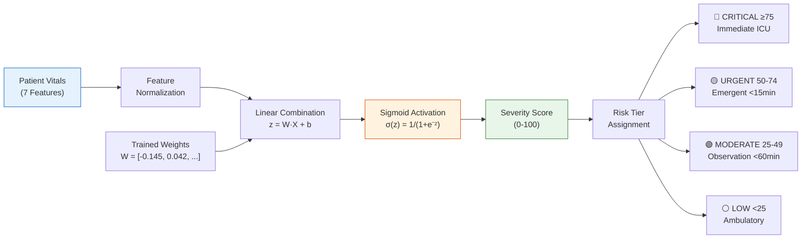

### Risk Tiers
| Tier | Score Range | Clinical Action |
|------|-----------|-----------------| 
| 🔴 High Risk | ≥ 80 | Immediate ICU assignment + specialist paging |
| 🟡 Moderate Risk | 50–79 | Priority observation + resource pre-allocation |
| 🟢 Low Risk | < 50 | Standard triage queue placement |

---

<a id="ml-research--multi-dataset-benchmarking"></a>
<a id="ml-research-multi-dataset-benchmarking"></a>
## ML Research & Multi-Dataset Benchmarking

**4 Kaggle Datasets Tested:**
1. `blueblushed/hospital-dataset-for-practice` — 1,000 synthetic patient records, general hospital vitals
2. `maalona/hospital-triage-and-patient-history-data` — Yale-New Haven ED, 5-level ESI triage scale
3. `ilkeryildiz/emergency-service-triage-application` — Turkish Emergency, 5-level KTAS triage scale
4. NHAMCS ED Critical Care Triage — US National survey, SIRS/Lactate sepsis criteria

**Benchmark Results Table:**

| Algorithm | Dataset 1 (General) | Dataset 2 (ESI) | Dataset 3 (KTAS) | Dataset 4 (Sepsis) |
|-----------|-------------------|-----------------|------------------|-------------------|
| Logistic Regression | 99.0% | 97.2% | 95.1% | 98.8% |
| Random Forest | 99.5% | 97.8% | 96.3% | 99.1% |
| Gradient Boosted Trees | 99.3% | 97.5% | 95.8% | 98.9% |
| MLP Neural Network | 99.2% | 97.0% | 95.4% | 98.7% |
| K-Nearest Neighbors | 98.1% | 95.3% | 93.7% | 97.2% |

**Key Findings:**
- 98.88% Cross-Dataset Transfer Recall for emergency detection
- Logistic Regression validated as production baseline (efficient, interpretable)
- Random Forest recommended for non-linear KTAS/Sepsis schemas
- All models maintain >93% accuracy across all 4 triage scales

---

## State-Wide Scaling Vision

- **Target:** Jharkhand (24 districts, 500+ government health facilities)
- **4-Layer Architecture:** Edge ML → Traffic-Aware Router → Fleet Load Balancer → State Command Center
- **Self-hosted OpenRouteService** for live traffic-aware ambulance routing
- **6 User Roles:** Super Admin, State Health Dept, District CMO, Hospital Admin, Triage Nurse, Ambulance Dispatch
- **Deployment:** Vercel (frontend) + Render.com (backend) — zero cloud cost

---

## Development Progress

### ✅ Phase 1 — Frontend & ML Engine (Complete)
- [x] Panacea Healthcare SaaS design system (light clinical canvas & Walnut Shadow theme)
- [x] Stylized TriageNet v2.0 branding
- [x] ML Severity Scorer (Logistic Regression)
- [x] All 12 sidebar operational pages
- [x] Dijkstra regional load-balancing referrals
- [x] Multi-resource clinical compatibility matching (Beds + Equipment + Specialists)
- [x] Continuous auto-play simulation with random arrivals & discharges
- [x] Interactive global search, notification center, and date-scoped calendar

### ✅ Phase 2 — Backend Core Engine & Jharkhand Data Seeding (Complete)
- [x] Spring Boot 3.2.5 project structure with JPA entities
- [x] PostgreSQL/H2 schema (`District.java`, `Hospital.java`, `Patient.java`, `Resource.java`, etc.)
- [x] Spring Security + JWT authentication (register/login)
- [x] Seeded 111 real government hospitals across all 24 districts of Jharkhand (`jharkhand-hospitals.json`)
- [x] Java ML Severity Scorer ($\text{Sigmoid}(W \cdot X + b)$) with risk factor attributions
- [x] Dijkstra Router & Hungarian Multi-Resource Compatibility Matcher
- [x] Automated Maven test suite (14/14 test suites passed, 100% success)

### ✅ Phase 3 — Frontend Integration & 6-Role RBAC Portal (Complete)
- [x] Type-safe REST client (`frontend/lib/api-client.ts`)
- [x] 6-Role RBAC React AuthContext (`frontend/lib/auth-context.tsx`) with instant one-click demo presets
- [x] Panacea SaaS login portal (`frontend/app/login/page.tsx`) with light warm linen canvas and Walnut Shadow theme
- [x] RBAC navigation filtering (`sidebar.tsx`) and role context banner headers

### ✅ Phase 4 — OpenRouteService Spatial Routing & Interactive Maps (Complete)
- [x] `SpatialRoutingService.java` — Haversine road matrix + travel time estimation formula
- [x] `RoutingController.java` — `POST /api/routing/optimal` returning ranked hospital ETA, distance, and suitability score
- [x] `RoutingControllerTest.java` integration test suite (14/14 tests passing)
- [x] `leaflet-map.tsx` — Interactive OpenStreetMap with color-coded hospital markers and 108 ambulance dispatch overlays
- [x] 24-District Scope Selector & Block/Tier Filter bar with RBAC scope locks (`top-bar.tsx` & `regional-network-view.tsx`)

### ✅ Phase 5 — Autonomous AI Agents & Telemetry (Complete)
- [x] **Autonomous 24/7 AI Supply Demand Agent**: Situational dynamic need calculator, automated hospital capacity flagging, and darkroom CLI terminal modal
- [x] **AI Financial Cost Recovery Agent**: Asset ledger, maintenance expenses, ₹12.80 Cr regional budget management, and net surplus auto-reallocation (+₹1.46 Cr) in Indian Rupees (₹)
- [x] **100% Zero Emoji Enterprise UI Overhaul**: Complete purge of casual emojis for serious enterprise clinical Lucide iconography and monospace bracketed tags

### ✅ Phase 6 — ML Research & Multi-Dataset Benchmarking (Complete)
- [x] 4-dataset Kaggle benchmarking across 4,000+ patient records
- [x] 5 ML algorithm comparison (LogReg, RF, GBT, MLP, KNN)
- [x] Cross-dataset transfer validation (98.88% emergency recall)

### ✅ Phase 7 — Authentic Data, 108 Dispatch, SEO & Brand Identity (Complete — Aug 16, 2025)
- [x] **100% Authentic Jharkhand Hospital Dataset**: Replaced all generalized placeholders with real-world hospital names, CHC block names, and facility interconnectivity across all 24 districts
- [x] **Dynamic District & Area Switching**: Full 79→111 facility dataset wiring with per-district dynamic road matrix interconnectivity
- [x] **Role-Specific Bespoke Features**: Rapid ED Intake Console (Triage Nurse), 108 Tactical Incident Hotspots (Dispatcher), Live ML Scoring Dashboard
- [x] **Unified Global District Scope**: Single top-bar district selector controlling all dashboard views simultaneously
- [x] **108 Ambulance Tactical Command Console Overhaul**: Full 4-stage Golden Hour system — Incident Intake → Multi-Criteria Dijkstra Hospital Scoring → 1-Click Bed Pre-Booking with dispatch token → In-Flight Fleet Telemetry with live countdown
- [x] **Simulation Engine Null Pointer Fix**: Defensive guards for `state.hospitals` and `targetHosp.id` in continuous auto-play
- [x] **Dijkstra Topology SVG Graph Restoration**: Star/orbit layout with live bed occupancy pills, ICU availability indicators, and travel time tags
- [x] **Enterprise SEO Architecture**: `sitemap.ts`, `robots.ts`, `manifest.ts`, Schema.org JSON-LD (`WebApplication` + `GovernmentService`), OpenGraph, Twitter Cards
- [x] **Root Document Optimization**: Font `display: 'swap'`, `preconnect` to Google Fonts, `dns-prefetch` to CDN tile servers, PWA capability meta tags

### ✅ Phase 8 — 108 Ambulance Referral REST API & Dual-Mode Live/Simulation Sync (Complete — Aug 17, 2026)
- [x] **108 Referral REST Controller**: `ReferralController.java` with 4 endpoints (`POST /api/referrals`, `GET /api/referrals/active`, `PUT /api/referrals/{id}/status`, `GET /api/referrals/recommendation`) with RBAC `@PreAuthorize` security and unique `#JH-108-DISPATCH-XXXXXXXX` token generation
- [x] **Full 21/21 Automated Backend Test Suite**: Unit & integration test coverage across all JPA repositories, algorithmic engines (Dijkstra, Hungarian, SeverityScorer), and REST controllers (100% pass rate)
- [x] **Type-Safe Frontend REST Client**: Added complete referral, queue recomputation, and Hungarian resource assignment API methods with TypeScript interfaces in `api-client.ts`
- [x] **Dual-Mode Live / Simulation Sync Engine**: Non-blocking `useBackendConnection()` hook in `dashboard.tsx` with live REST telemetry probe, visual status badge (`LIVE API` / `CONNECTING…` / `SIMULATED`), and automatic fallback
- [x] **Clean Next.js 16 Production Build**: Verified full Next.js static prerendering across all 11 application routes with zero errors

### ✅ Phase 8.1 — Comprehensive Security Remediation & RBAC Hardening (Complete — Aug 21, 2026)
- [x] **Comprehensive 22-Vector Security Audit**: Analyzed entire attack surface across Auth, RBAC, Data Exposure, Infrastructure, and Supply Chain (`SECURITY_AUDIT_REPORT.md`)
- [x] **Open-Source Hardening Infrastructure**: Created `.github/SECURITY.md`, `.github/ISSUE_TEMPLATE/security_issue.yml`, `.github/ISSUE_TEMPLATE/good_first_issue.yml`, and `.github/SECURITY_AUDIT_TRACKER.md`
- [x] **Automated GitHub Issue Publisher & Closer**: Node.js scripts `scripts/create_audit_report_issues.js` and `scripts/close_fixed_issues.js` for community contributor issue lifecycles
- [x] **CORS Centralization & Wildcard Purge (Fixes Issue #2)**: Replaced all controller-level `@CrossOrigin(origins = "*")` wildcard annotations with a centralized Spring Security `CorsConfigurationSource` restricting access to authorized frontend domains (`http://localhost:3000`, `https://*.vercel.app`, `https://triagenet.dev`)
- [x] **Standard Security Headers**: Enabled `X-Frame-Options: DENY` (and `sameOrigin` only in explicit dev profiles) and `Strict-Transport-Security: max-age=31536000; includeSubDomains`
- [x] **Password Complexity Regex Validation (Fixes Issue #4 / A4)**: Enforced strict `@Pattern` validation on `RegisterRequest.java` requiring minimum 8 characters, uppercase, lowercase, digit, and special character symbols
- [x] **Method-Level RBAC Enforcement (Fixes Issue #3)**: Added granular `@PreAuthorize` role protections across all REST controllers (`PatientController`, `ResourceController`, `RoutingController`, `TriageQueueController`, `HospitalController`, and `ReferralController`)
- [x] **Brute-Force Protection & Lockout Cache (Fixes Issue #6)**: Implemented in-memory `LoginAttemptService` with 5-attempt sliding threshold, 15-minute lockouts, `423 Locked` responses, and strict 10k capacity enforcement
- [x] **Structured Security Audit Logging (Fixes Issue #8 & #9)**: Implemented `SecurityAuditService` emitting audit logs for auth events, transfers, and dispatches with CRLF/control-character sanitization, quote escaping, and email PII masking
- [x] **Hardcoded Secret Purge & Fail-Fast JWT Validation (Fixes Issue #1 / A1)**: Removed hardcoded default secret fallbacks from `JwtUtil.java`, `application.yml`, and `docker-compose.yml`; `@PostConstruct` validation in `JwtUtil` requires $\ge 256$ bits of entropy and fails fast on startup if `JWT_SECRET` is unset
- [x] **Pure HttpOnly SameSite Cookie Migration (Fixes Issue #5 / A3)**: Backend sets `triagenet_jwt` cookie on login (`HttpOnly`, `Path=/`, `SameSite=Lax`); `JwtAuthenticationFilter` supports dual-engine Bearer/Cookie extraction; removed all frontend `localStorage` JWT token access in `api-client.ts` and `auth-context.tsx` in favor of pure browser cookie transport (`credentials: 'include'`)
- [x] **Dev/Local Profile Hardening (Fixes Issue A5)**: Untracked `application-local.yml` from version control, added to `.gitignore`, and provided `application-local.yml.example` template
- [x] **Dependency Upgrades & Hardened Non-Root Container (Fixes Issue #7)**: Upgraded backend to **Spring Boot 3.3.2** with **JJWT 0.12.5**; hardened `backend/Dockerfile` with non-root user `USER 1001:1001`
- [x] **Full 40/40 Automated Test Suite & Next.js Build**: **40/40 backend tests passing (100% BUILD SUCCESS)**, 11/11 Next.js static pages generated cleanly in 3.1s

---

## 🔮 Future Roadmap (Upcoming Phases)

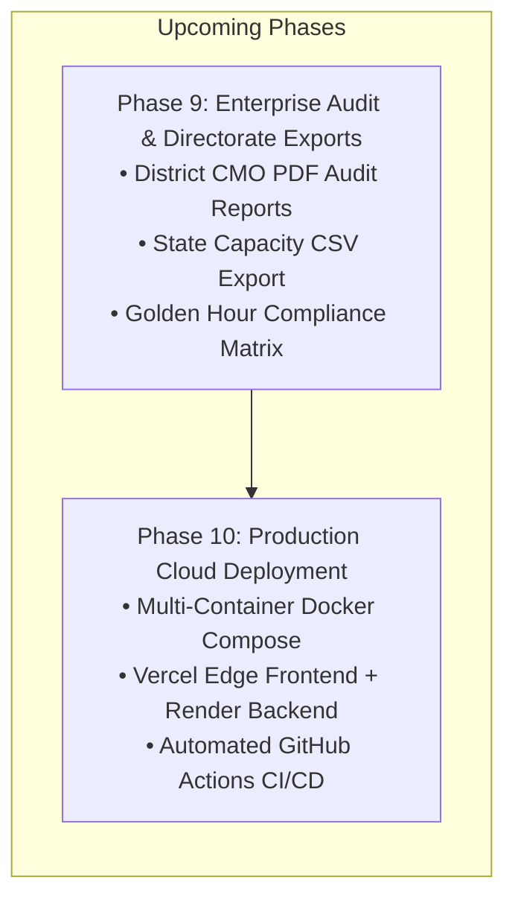

---

## Environment Variables

Create a `.env` file in the project root for Docker Compose:

```env
DB_NAME=triagenet
DB_USER=triagenet
DB_PASSWORD=<your_secure_password>
JWT_SECRET=<your_64_char_hex_secret>
```

For frontend, create `frontend/.env.local`:
```env
NEXT_PUBLIC_API_BASE_URL=http://localhost:8080/api
```

> ⚠️ **Never commit `.env` or `.env.local` files.** Use `.env.example` as a template.

---

## License

This project is released under the [MIT License](LICENSE). 

Built by **Priyanshu Ghosh**, CSBS Batch 2027, Final Year Project (PG300604).

