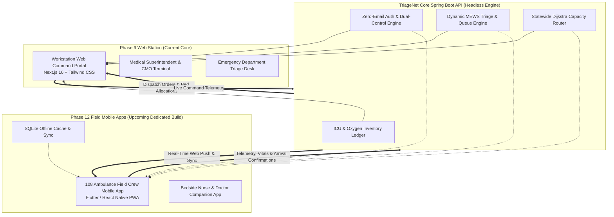

# TriageNet Architecture & Multi-Phase Strategic Roadmap

> **Official Master Blueprint & Future Implementation Record**  
> *Documented for Jharkhand State Health Command System*

---

## 📌 Architectural Vision: Separation of Triage Web vs. Field Mobile Apps

TriageNet is fundamentally architected as a **headless, decoupled, micro-service capable state healthcare platform**. The platform strictly separates the central workstation command dashboards used inside stationary hospital environments from lightweight, ruggedized mobile endpoints needed by mobile field emergency crews and rotating ward staff.

### The 6 Web Command Station Leadership Roles (This Web Platform)
This central web portal is reserved exclusively for the **6 designated leadership and station command roles** that control healthcare operations, facility quotas, and clinical staff:

1. **State Health Command (`SUPER_ADMIN`)**:
   - **Scope**: Statewide Operations (Controls all 24 districts).
   - **Authority**: Global triage routing, node management, hospital quotas, statewide surge declarations, system audit logs.
2. **District Chief Medical Officer (`DISTRICT_CMO`)**:
   - **Scope**: Single District Command.
   - **Authority**: District-wide bed quotas, inter-facility transfer approvals, regional surge overrides, emergency escrow.
3. **Medical Superintendent (`HOSPITAL_ADMIN`)**:
   - **Scope**: Single Hospital Facility Command.
   - **Authority**: Hospital ICU & Oxygen capacity, equipment status, physical badge verification of staff, inter-facility patient transfer authorizations.
4. **Lead Emergency Triage Nurse (`TRIAGE_NURSE`)**:
   - **Scope**: Hospital Emergency Department (ED) Triage Desk Station.
   - **Authority**: Bedside MEWS (Modified Early Warning Score) calculation, acuity queue prioritization, critical patient intake, shift management.
5. **108 Central Ambulance Dispatcher (`AMBULANCE_DISPATCH`)**:
   - **Scope**: Regional Central Fleet Dispatch Desk.
   - **Authority**: Fleet assignment, spatial Dijkstra routing, emergency vehicle routing, dispatching orders to field ambulances.
6. **Medical Officer (`HOSPITAL_STAFF`)**:
   - **Scope**: Hospital Ward & Bed Intake Control (Hospital In-Charge).
   - **Authority**: General ward admissions, bed tracking, patient intake & ward assignments.

---

### Downstream Dedicated Mobile Apps (Field Staff & Ward Staff)
Routine ward nurses, field ambulance drivers/EMTs, and rotating bedside junior doctors do **not** log into this central web hub. Instead:
- They will operate **dedicated, lightweight client applications** (e.g. *108 Ambulance Field Crew App*, *Bedside Nurse Companion App*).
- **Two-Way Closed Network Loop**:
  1. Higher officials on this TriageNet Web Hub issue commands (e.g. ambulance dispatch, inter-facility transfer approval, ward bed allocation).
  2. Downstream mobile apps receive real-time notifications and compact JSON payloads (`<2KB`).
  3. Field crew and ward staff execute the tasks and submit status updates back to TriageNet over REST / WebSockets.
  4. The state healthcare command dashboard reflects live patient, bed, and fleet telemetry in real time.

---

## 🚀 Phase-by-Phase Roadmap

### ✅ Phase 1 to Phase 8: Core Foundation (Completed)
- **Phase 1**: Regional Triage & Capacity Allocation Simulation Engine.
- **Phase 2**: Real-time State Geographic Modeling & Facility Tiering.
- **Phase 3**: Dijkstra-based Resource & Distance Optimal Routing.
- **Phase 4**: Real-time Bed, ICU, and Oxygen Reservation Protocols.
- **Phase 5**: MEWS (Modified Early Warning Score) Bedside Triage Algorithms.
- **Phase 6**: Spring Boot Enterprise Backend Migration with PostgreSQL/H2 persistence.
- **Phase 7**: State-wide Seed Data: 24 Districts, 111 Real Healthcare Facilities across Jharkhand.
- **Phase 8**: Next.js 16 Production Frontend with Live WebSocket / REST dual-mode connectivity.

---

### ✅ Phase 9.1: Cryptographic Authentication & Shift Sessions (Completed)
- **Elimination of Third-Party Auth & SMS Dependencies**:
  - Nullified reliance on third-party cloud auth providers (Firebase, Auth0, Supabase) and SMS OTP gateways (preventing SS7 interception and vendor data lock-in).
- **RFC 6238 HMAC-SHA1 TOTP Engine**:
  - 100% offline time-based one-time password generation compatible with Google Authenticator, Aegis, and hardware tokens.
  - $\pm 1$ step clock drift compensation (90-second total window).
- **12-Word BIP-39 Cryptographic Recovery Phrases & Emergency Backup Codes**:
  - 128-bit CSPRNG generation using a curated English wordlist.
  - 8 single-use emergency backup codes formatted as `TR-XXXX-XXXX`.
  - Zero plain-text storage: all recovery credentials stored exclusively as salted SHA-256 hashes.
- **8h/12h Clinical Shift Sessions with 4-Digit Quick-Lock Screen**:
  - Automatic screen lock after 20 minutes of inactivity.
  - 1-second tactile numeric PIN unlock to prevent repeated password logins during emergency duty.
- **Multi-Factor Account Recovery Portal (`/recovery`)**:
  - Pathway 1: 12-Word BIP-39 recovery phrase.
  - Pathway 2: Single-use emergency backup code.
  - Pathway 3: District CMO emergency escrow bypass (issues 15-minute high-security triage bypass token).

---

### ✅ Phase 9.2: Official Staff ID Architecture & Dual-Control Onboarding (Completed)
- **Staff ID Primary Credential (`JH-STF-XXXX`)**:
  - Shifted primary authentication and self-registration identifier from email to official Healthcare Staff ID.
  - Retained backward-compatible dual lookup (`findByStaffIdOrEmail`) for seed and administrative accounts.
- **Continuous 4-Stage Onboarding Flow**:
  - **Stage 1 (Identity)**: Staff Name, Staff ID (auto-generated if unassigned), Official Email, Role, Affiliated Hospital.
  - **Stage 2 (Password)**: Master Password with complexity enforcement.
  - **Stage 3 (Cryptographic Packet)**: Instant TOTP QR code, secret key, 12-word mnemonic backup phrase, and emergency backup codes.
  - **Stage 4 (Completion & Dual-Control Notice)**: Congratulatory summary card informing clinician that physical badge verification is pending.
- **Zero-Email Public Status Probe (`GET /api/auth/status/{staffId}`)**:
  - Real-time probe allowing clinicians to check whether their Staff ID has been verified without needing email or SMS notifications.
- **Hospital Admin Dual-Control Verification Queue**:
  - `GET /api/admin/staff/pending`: Hospital Medical Superintendents and District CMOs inspect pending staff registrations.
  - `POST /api/admin/staff/{id}/approve`: Activates account and assigns official clinical role.
  - `POST /api/admin/staff/{id}/reject`: Rejects fraudulent or duplicate staff registrations.
  - Audit logging with `AUTH_STAFF_APPROVED` and `AUTH_STAFF_REJECTED`.

---

### ✅ Phase 9.3: Clinical SaaS UI Modernization & Doctor Availability (Completed)
- **Design System Overhaul**:
  - Synthesized modern clinical dashboard design patterns (Boltshift, Globetrans, Transaction History, Bright Leads, Starline) with Plus Jakarta Sans geometric typography.
  - De-cluttered Top Bar by removing duplicate simulation steps and unauthenticated redirect links.
- **Doctor & Specialist Availability Roster**:
  - Replaced legacy appointment booking with on-duty specialist capacity tracking across departments.
  - Interactive physician profile inspection and 1-click emergency paging to trauma bays.

---

### 🔮 Phase 9.4: Clinician & Doctor Profile Customization System (Next Sprint)
- **Individualized Profile Cards for Every Health Professional**:
  - Dedicated personal profile card for each user and staff member with qualifications, medical council registration, affiliated facility, active shift hours, and comms extensions.
  - User-configurable card layout allowing clinicians to personalize their information.
- **Universal Cross-User Profile Inspection**:
  - Clicking any doctor, triage nurse, or administrator anywhere in TriageNet opens their standardized credential card.
- **Decoupled Auth & Clean Navigation**:
  - Dedicated login entry point; session termination strictly returns to `/login`.

---

### ✅ Phase 9.5: AI Predictive Shortage Recording & Proactive Pre-Fetch Engine (Completed & Embedded)
- **Bottom-Up Shortage Incident Recording**:
  - Frontline triage nurses, ward in-charges, and emergency medical officers log local equipment or bed deficits with structured incident tokens (`#SHORT-2026-XXXX`).
  - Tracks specific resource shortages (ICU Beds, Ventilators, High-Flow O₂, Multipara Monitors, Blood Units) along with active patients impacted.
- **AI Automated Correlation & Predictive Logistics**:
  - Correlates nurse incident logs with incoming 108 ambulance admissions and admission velocity.
  - Generates predictive pre-fetch recommendations (`PredictiveInventoryRecommendation`) determining *which inventory to fetch beforehand* from nearby reserve depots or donor CHCs before bottlenecks occur.
- **Proactive Insights Delivered to Triage Desks & Command Leadership**:
  - Triage Lead receives proactive alert banners right in the Triage Queue with 1-click `[Pre-Fetch Units from Reserve]` actions.
  - District CMOs and State Health Directorate receive aggregated shortage trends to rebalance shares and negotiate bulk GeM rate contracts before statewide stockouts.

---

### 🔮 Phase 10: FIDO2 / WebAuthn Hardware Security Keys (Planned)
- **Physical YubiKey & Biometric Passkey Support**:
  - Add W3C WebAuthn API support allowing hospital staff to tap a USB-C/NFC hardware key (YubiKey 5 Series) or scan a hospital-issued fingerprint/Windows Hello sensor.
  - Eliminates manual typing of 6-digit TOTP codes during trauma resuscitation.
- **Cryptographic Attestation & FIPS 140-3 Compliance**:
  - Hardware-bound private key storage ensuring credentials cannot be exported or cloned.

---

### 🔮 Phase 11: Real-Time Bed & Oxygen IoT Telemetry (Planned)
- **Direct Hospital Plant Telemetry Integration**:
  - Ingestion endpoints for PSA oxygen generators and liquid medical oxygen (LMO) tank pressure sensors.
  - Automated ICU ventilator status polling via HL7/FHIR protocols.
  - Automated bed pressure-mat sensors to mark beds occupied/released without manual entry by nursing staff.

---

### 🔮 Phase 12: 108 Ambulance Field Crew Dedicated Mobile App (Planned)
- **Purpose-Built Dedicated Mobile Architecture**:
  - Moving ambulances experience severe vibration, high-contrast sunlight, and intermittent cellular connectivity (2G/3G in rural Jharkhand).
  - Web dashboards with large SVG network graphs are ill-suited for ambulance dashboards.
- **Key Technical Specifications**:
  - **Lightweight Engine**: Headless Flutter or React Native Progressive Web Application (PWA).
  - **Ultra-Low Bandwidth Payloads**: JSON payloads strictly optimized to `< 2KB` per dispatch update.
  - **Offline SQLite Queue**: Store vital signs, trauma scores, and GPS logs locally when offline; automatically syncs once 4G/satellite connection reconnects.
  - **One-Thumb Large Touch Targets**: High-contrast UI designed for paramedics wearing medical gloves in transit.
  - **Continuous GPS Beaconing**: Periodic low-power telemetry pings to `/api/routing/fleet/telemetry` for live ambulance tracking on the hospital command map.

---

### 🔮 Phase 13: Zero-Email W3C Web Push & Sound Beacon Notifications (Planned)
- **Native Browser / Mobile Push (Zero Email / Zero SMS)**:
  - Utilize standard W3C Web Push with VAPID keys.
  - When an admin approves a clinician's Staff ID, a background push notification is delivered directly to their registered browser or station.
- **Acoustic Emergency Sirens for Mass Casualty Events**:
  - WebSocket-driven real-time audio alerts inside triage stations when incoming trauma ambulances enter a 5km geofence radius.

---

### 🔮 Phase 14: Ayushman Bharat Digital Mission (ABDM) Integration (Planned)
- **ABHA (Ayushman Bharat Health Account) Linking**:
  - Patient lookup via 14-digit ABHA ID.
  - Consent-based electronic health record (EHR) retrieval directly upon emergency triage intake.
  - Immediate access to past medical history, blood type, known allergies, and cardiac conditions before ambulance arrival.

---

## 🛡️ Non-Negotiable Security Principles
1. **No External Auth Dependencies**: Authentication secrets must remain on state-controlled infrastructure.
2. **Zero Plaintext Credentials**: All passwords, TOTP seeds, 12-word phrases, and backup codes must be cryptographically hashed (BCrypt, SHA-256).
3. **Dual-Control Verification**: Self-registered accounts must never receive unvetted clinical privileges without physical or superintendent sign-off.
4. **Resilient Clinical Shift Model**: Emergency doctors must never be locked out mid-procedure due to network drops or session timeouts.
